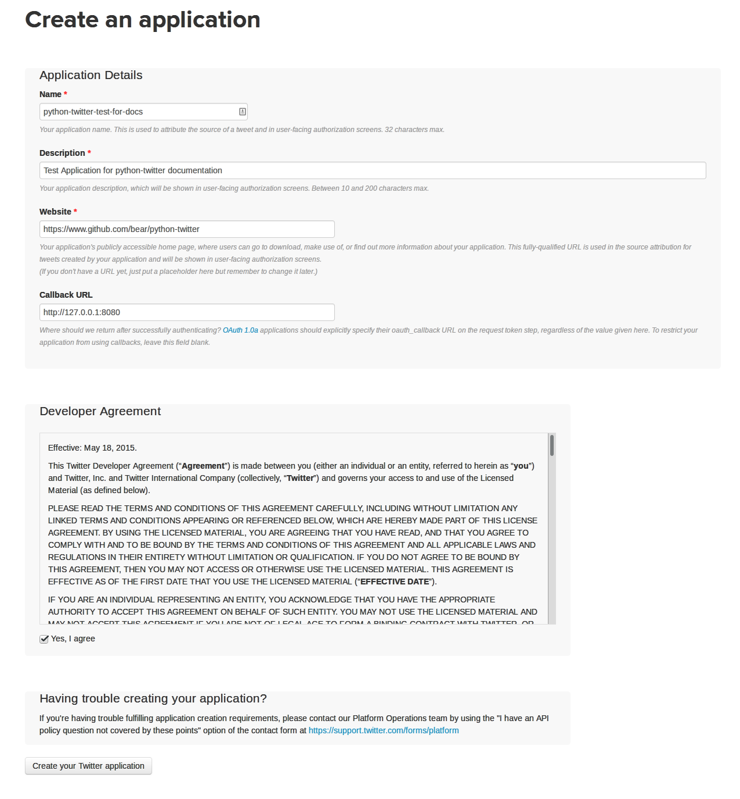
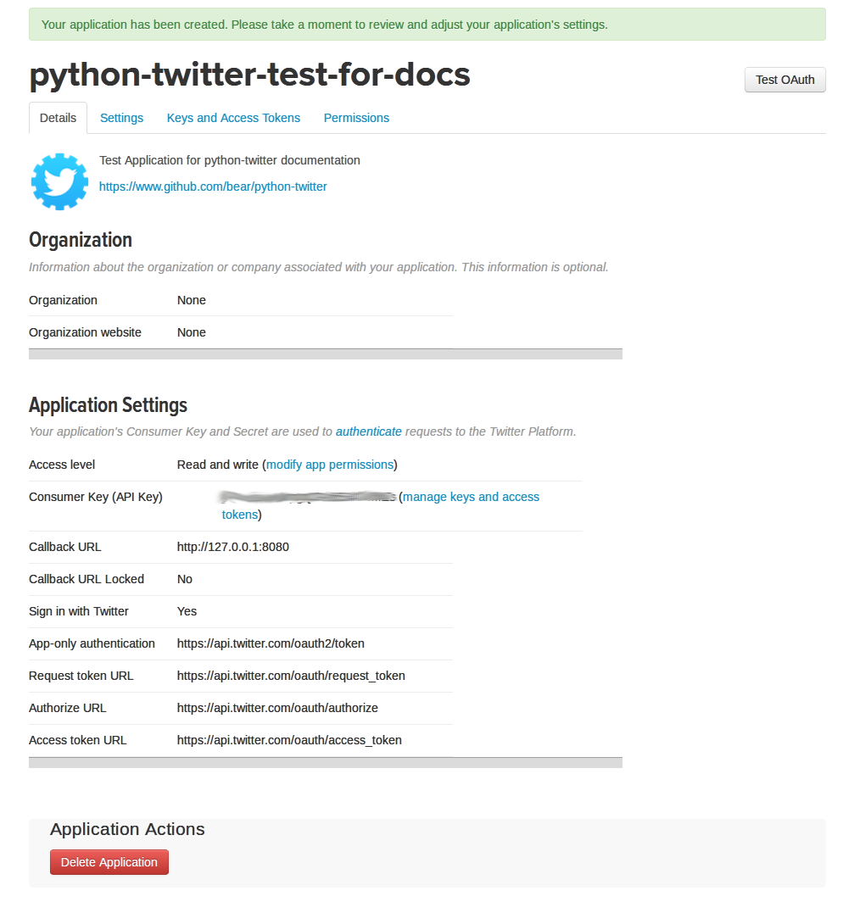
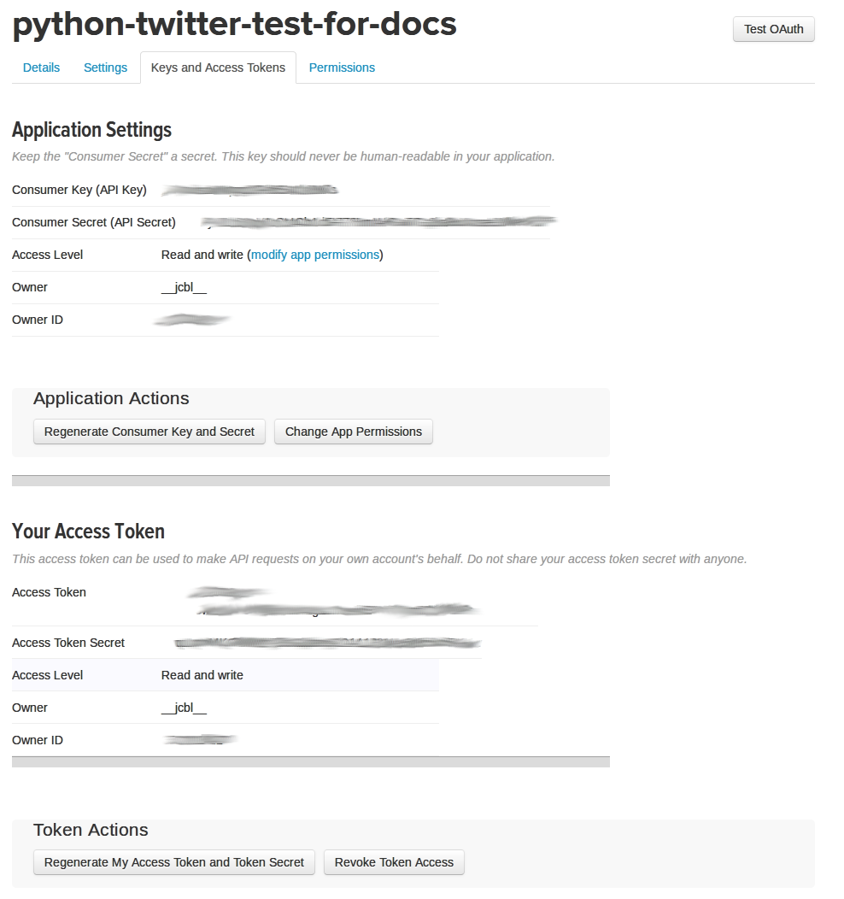

Getting Started
===============

Getting your application tokens
+++++++++++++++++++++++++++++++

.. danger::

This section is subject to changes made by Twitter and may not always be completely up-to-date. If you see something change on their end, please create a `new issue on Github <https://github.com/bear/python-twitter/issues/new>`_ or submit a pull request to update it.

In order to use the python-twitter API client, you first need to acquire a set of application tokens. These will be your ``consumer_key`` and ``consumer_secret``, which get passed to ``twitter.Api()`` when starting your application.

Create your app
________________

The first step in doing so is to create a `Twitter App <https://apps.twitter.com/>`_. Click the "Create New App" button and fill out the fields on the next page.

If there are any problems with the information on that page, Twitter will complain and you can fix it. (Make sure to get the name correct - it is unclear if you can change this later.) On the next screen, you'll see the application that you created and some information about it:

Your app
_________

Once your app is created, you'll be directed to a new page showing you some information about it.

Your Keys
_________

Click on the "Keys and Access Tokens" tab on the top there, just under the green notification in the image above.

At this point, you can test out your application using the keys under "Your Application Tokens". The ``twitter.Api()`` object can be created as follows::

    import twitter
    api = twitter.Api(consumer_key=[consumer key],
                      consumer_secret=[consumer secret],
                      access_token_key=[access token],
                      access_token_secret=[access token secret])

Note: Make sure to enclose your keys in quotes (ie, api = twitter.Api(consumer_key='1234567', ...) and so on) or you will receive a NameError.

If you are creating an application for end users/consumers, then you will want them to authorize you application, but that is outside the scope of this document.

And that should be it! If you need a little more help, check out the `examples on Github <https://github.com/bear/python-twitter/tree/master/examples>`_. If you have an open source application using python-twitter, send us a link and we'll add a link to it here.
